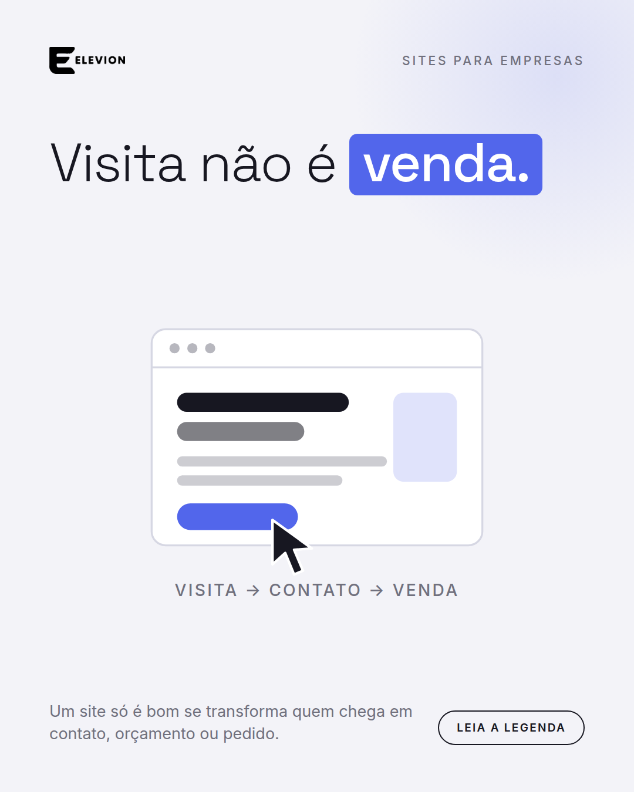
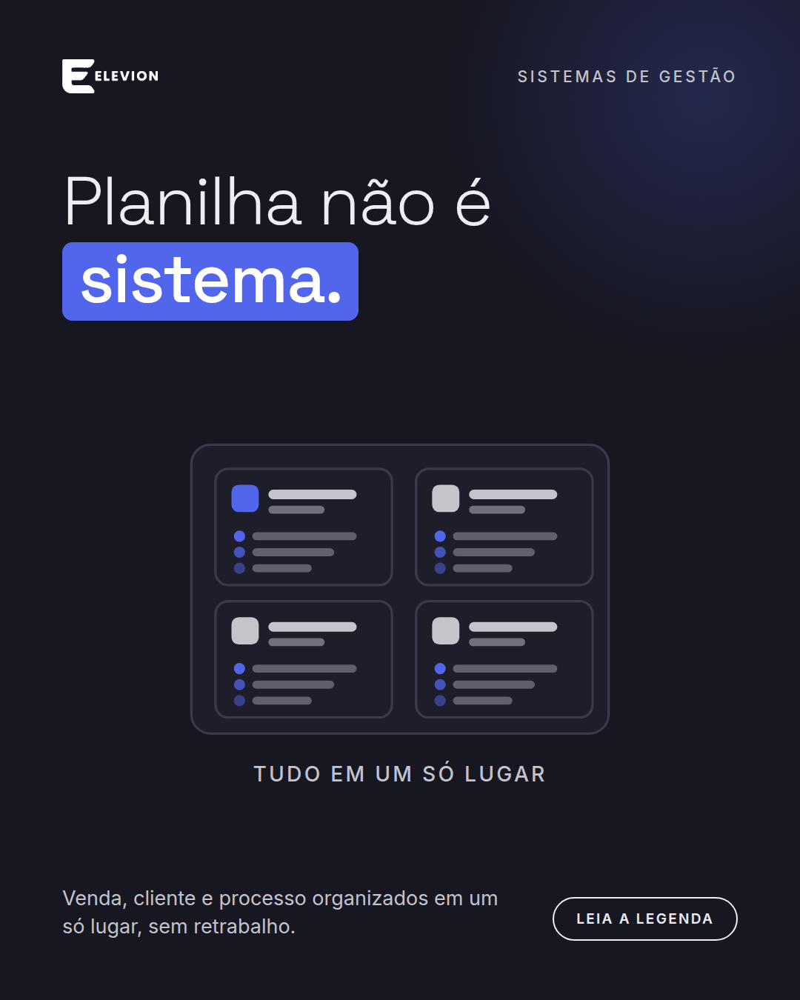
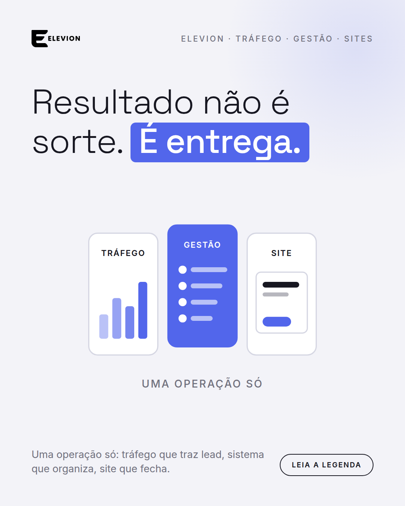
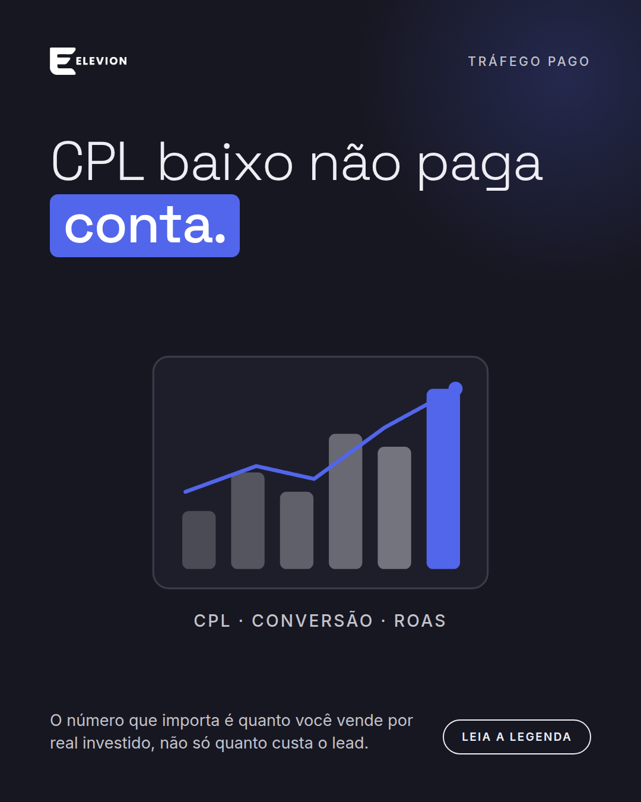
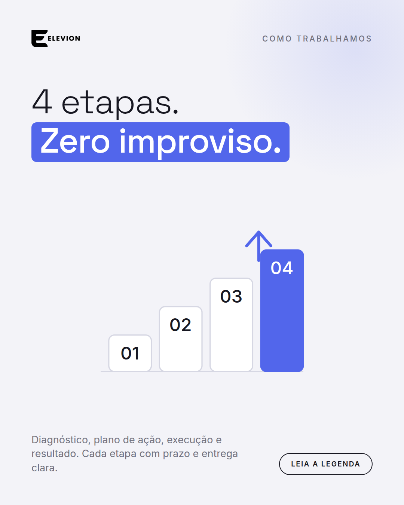
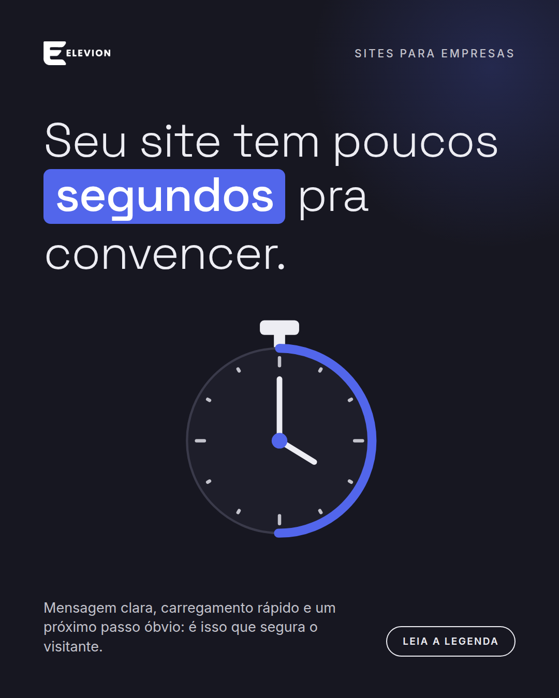
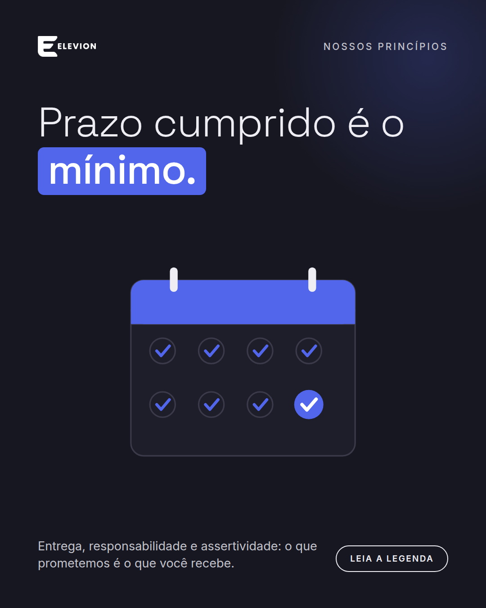
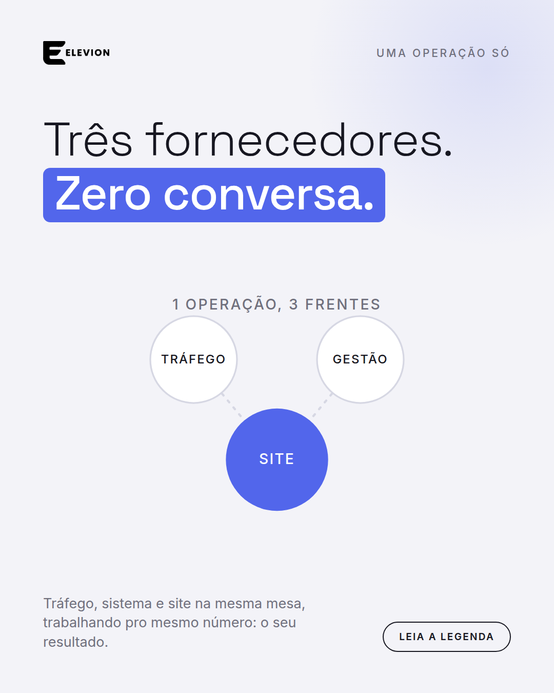
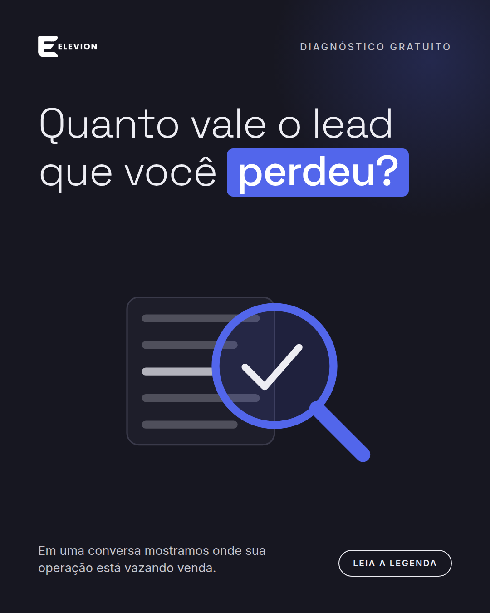

# Calendário de postagens — ELEVION (12/10 a 06/11/2026)

Feed do Instagram, 3 posts por semana (seg/qua/sex, às 12h), formato 4:5 (1080x1350).
Linha visual inspirada na referência (gancho curto + palavra-chave destacada + objeto central + "Leia a legenda"),
traduzida pra identidade ELEVION: onyx `#171721`, ivory `#ededf3`, cobalto `#5266eb`, Space Grotesk + Inter.
Alterna fundo escuro e claro pra formar o xadrez no grid.

| # | Data | Pilar | Formato | Gancho | Peça |
|---|------|-------|---------|--------|------|
| 1 | Seg 12/10 | Tráfego pago | Imagem única | Você paga por clique ou por cliente? | [post-01.png](posts/post-01.png) |
| 2 | Qua 14/10 | Sites | Imagem única | Visita não é venda. | [post-02.png](posts/post-02.png) |
| 3 | Sex 16/10 | Sistemas de gestão | Imagem única | Planilha não é sistema. | [post-03.png](posts/post-03.png) |
| 4 | Seg 19/10 | Autoridade | Imagem única | Resultado não é sorte. É entrega. | [post-04.png](posts/post-04.png) |
| 5 | Qua 21/10 | Tráfego pago | Imagem única | CPL baixo não paga conta. | [post-05.png](posts/post-05.png) |
| 6 | Sex 23/10 | Processo | Imagem única | 4 etapas. Zero improviso. | [post-06.png](posts/post-06.png) |
| 7 | Seg 26/10 | Sites | Imagem única | Seu site tem poucos segundos pra convencer. | [post-07.png](posts/post-07.png) |
| 8 | Qua 28/10 | Gestão | Imagem única | Seu lead esfriou no WhatsApp? | [post-08.png](posts/post-08.png) |
| 9 | Sex 30/10 | Princípios | Imagem única | Prazo cumprido é o mínimo. | [post-09.png](posts/post-09.png) |
| 10 | Seg 02/11 | Autoridade | Imagem única | Três fornecedores. Zero conversa. | [post-10.png](posts/post-10.png) |
| 11 | Qua 04/11 | Diagnóstico | Imagem única | Quanto vale o lead que você perdeu? | [post-11.png](posts/post-11.png) |
| 12 | Sex 06/11 | Conversão | Imagem única | Descubra onde sua operação vaza. | [post-12.png](posts/post-12.png) |

**Mix de pilares:** tráfego pago (2), sites (2), gestão (2), autoridade/processo/princípios (4), diagnóstico e conversão (2).

## Legendas

### 1. Seg 12/10 — Você paga por clique ou por cliente?


Clique não paga boleto. Lead qualificado, sim.  
  
A gente configura Google Ads e Meta Ads pra trazer gente pronta pra comprar — e você acompanha CPL, conversão e ROAS toda semana.  
  
Quer saber o que sua campanha está entregando de verdade? Chama no WhatsApp pelo link da bio.

#trafegopago #googleads #metaads #marketingdigital #elevion

### 2. Qua 14/10 — Visita não é venda.



Site bonito que ninguém usa pra fechar negócio é só cartão de visita caro.  
  
A ELEVION faz sites pensados pra converter visita em cliente: caminho claro, chamada direta e contato a um toque.  
  
Seu site hoje leva o visitante até o WhatsApp? Se não, vale conversar.

#siteparaempresas #webdesign #conversao #elevion

### 3. Sex 16/10 — Planilha não é sistema.



Planilha quebra quando a operação cresce.  
  
Criamos sistemas de gestão sob medida pra sua empresa: tudo organizado em um só lugar, do lead à entrega.  
  
Quantas abas você abre pra fechar uma venda? Conta pra gente nos comentários.

#sistemadegestao #gestaoempresarial #automacao #elevion

### 4. Seg 19/10 — Resultado não é sorte. É entrega.



Resultado não é sorte. É entrega.  
  
A ELEVION junta tráfego, gestão e site numa operação só — sem você ter que coordenar três fornecedores.  
  
Salva esse post pra lembrar na hora de contratar.

#elevion #marketingdigital #trafegopago #sites #gestao

### 5. Qua 21/10 — CPL baixo não paga conta.



Lead barato que não compra só enche o CRM.  
  
Por isso olhamos CPL, conversão e ROAS juntos — e mostramos isso toda semana, não só num relatório mensal genérico.  
  
Qual métrica você acompanha hoje?

#roas #cpl #trafegopago #performance #elevion

### 6. Sex 23/10 — 4 etapas. Zero improviso.



Do diagnóstico ao resultado, o caminho é sempre o mesmo e você sabe em que etapa está:  
  
01 Diagnóstico  
02 Plano de ação  
03 Execução  
04 Resultado  
  
Quer começar pelo diagnóstico gratuito? Link na bio.

#processo #metodo #gestao #elevion

### 7. Seg 26/10 — Seu site tem poucos segundos pra convencer.



O visitante decide rápido se fica ou sai.  
  
Por isso a primeira tela do seu site precisa dizer o que você faz, pra quem, e qual é o próximo passo.  
  
Se quiser uma opinião sincera sobre o seu site, é só chamar.

#site #ux #conversao #landingpage #elevion

### 8. Qua 28/10 — Seu lead esfriou no WhatsApp?


Lead respondido rápido e acompanhado fecha mais.  
  
Um sistema simples de gestão organiza quem chegou, em que etapa está e quem precisa de retorno.  
  
Seu time sabe hoje quantos leads estão sem resposta?

#vendas #crm #atendimento #whatsappbusiness #elevion

### 9. Sex 30/10 — Prazo cumprido é o mínimo.



Três princípios guiam tudo o que fazemos: entrega, responsabilidade e assertividade.  
  
Na prática: prazo cumprido, processo claro e resultado mensurável.  
  
O que você mais valoriza num parceiro? Deixa aqui embaixo.

#valores #entrega #responsabilidade #elevion

### 10. Seg 02/11 — Três fornecedores. Zero conversa.



Agência de tráfego, desenvolvedor de site e fornecedor de sistema raramente conversam entre si.  
  
Na ELEVION é uma operação só, com um responsável e uma meta.  
  
Marca alguém que ainda está coordenando três fornecedores.

#agencia #marketing #operacao #elevion

### 11. Qua 04/11 — Quanto vale o lead que você perdeu?



Todo negócio perde lead em algum ponto: no anúncio, no site ou no atendimento.  
  
O diagnóstico gratuito da ELEVION aponta onde está o vazamento e o que fazer primeiro.  
  
Sem compromisso. Link na bio.

#diagnostico #vendas #marketing #elevion

### 12. Sex 06/11 — Descubra onde sua operação vaza.


Resultado não é sorte. É entrega.  
  
Solicite seu diagnóstico gratuito e receba resposta em poucas horas pelo WhatsApp.  
  
Link na bio.

#elevion #diagnosticogratuito #trafegopago #sites #gestao

## Como editar

Texto e ilustrações ficam em `src/posts.mjs`. Depois de editar:

```bash
npm i --no-save playwright-core   # uma vez
node src/render.mjs               # regera posts/*.png
node src/calendario.mjs           # regera este arquivo
```
